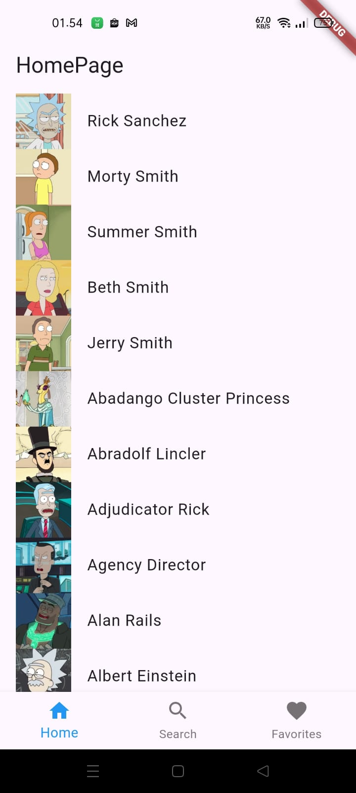
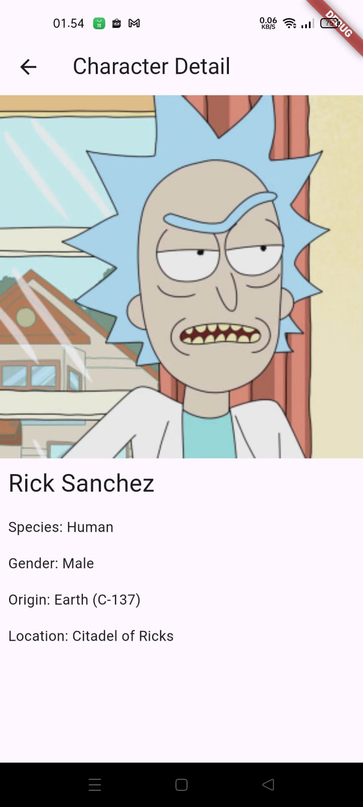
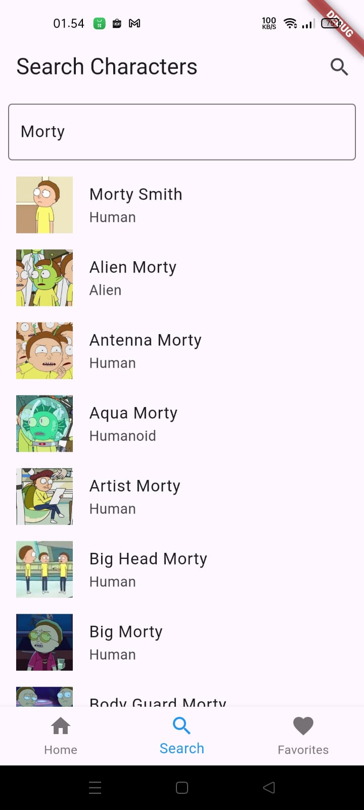
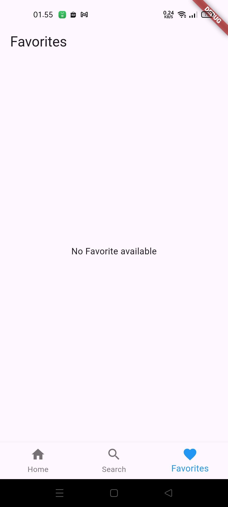

# BIGIO Mobile Dev - Take Home Challange

## Introduction :
Proyek Mobile Flutter untuk menampilkan karakter dari animasi yang berjudul Rick and Morty menggunakan [The Rick And Morty API](https://rickandmortyapi.com/). Proyek ini berisikan empat halaman utama yaitu HomePage, SearchPage, DetailPage, dan FavoritePage. 
- HomePage berisikan list dari beberapa karakter
- SearchPage berisikan  pencarian karakter berdasarkan nama
- DetailPage berisikan penjelasan dari karakter yang kita pilih
- FavoritePage berisikan daftar karakter favorite, namun dalam proyek ini saya tidak mampu menyelesaikannya sesuai dengan yang diminta

## Table of Contents
- [Introduction](#Introduction)
- [Features](#Features)
- [Library](#Library)
- [Project Structure](#ProjectStructure)
- [APK Link](#APKLink)

## Features
- List of character
- Detail of character
- Favorite character
- Search for characters

## Library
- [Flutter](https://flutter.dev/) 3.24.0-1.0.pre.217
- [Dart](https://dart.dev/) 3.6.0-55.0.dev
- [http](https://pub.dev/packages/http) 1.2.2
- [flutter_bloc](https://pub.dev/packages/flutter_bloc) 8.1.6
- [equatable](https://pub.dev/packages/equatable) 2.0.5
- [bloc](https://pub.dev/packages/bloc) 8.1.4
- [sqflite](https://pub.dev/packages/sqflite) 2.3.3+1
- [build_runner](https://pub.dev/packages/build_runner) 2.4.11

## Project Structure
- data
* `datasources`
* `local`
* `models`
* `repositories`
- domain 
* `repositories`
* `usecases`
- presentation
* `bloc`
* `pages`

## APK Link
[Application Link](https://drive.google.com/drive/folders/1f9UF6EfOe0kQXGD-TJ7apM0oWBNtI5Kn?usp=sharing)

## Screenshots
| Homepage | Detailpage | Searchpage | Favoritepage |
| -------- | ---------- | ---------- | ---------- |
|  |  |  |  |
